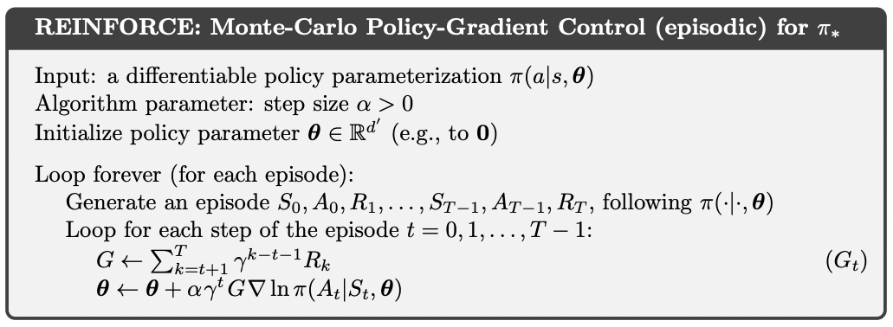

# Reinforce

My implementation of REINFORCE RL algorithm from ground up.

## Install

    conda env create -f environment.yml
    conda activate reinforce
    pip install -r requirements.txt

## References

See p.328 of Reinforcement Learning 2nd Ed. Sutton & Barto.

