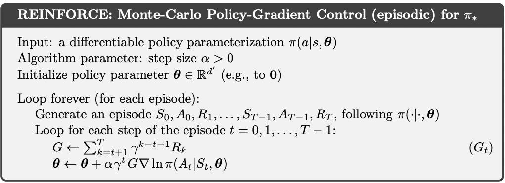

# Reinforce

My implementation of REINFORCE RL algorithm from ground up.

## Video Explanation
See my video about REINFORCE here: https://youtu.be/c86FBrhygQ4

## Install

    conda env create -f environment.yml
    conda activate reinforce
    pip install -r requirements.txt

## References

See p.328 of Reinforcement Learning 2nd Ed. Sutton & Barto.

--Andriy Drozdyuk

## See Also

To see how to implement this in [tianshou](https://github.com/thu-ml/tianshou) RL framework see my implementation here https://github.com/drozzy/reinforce_tianshou.